# Windows 中使用 Doxygen 自动生成文档

环境：

* Windows 10
* Visual Studio 2019
* Doxygen 1.9.1

## Doxygen 安装

首先需要下载 Doxygen Windows 可执行程序，下载地址：[https://www.doxygen.nl/download.html](https://www.doxygen.nl/download.html)。

这里直接下载 Windows 的安装程序，下载完成后直接安装即可。

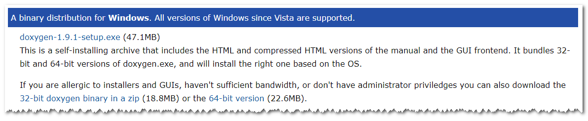

## 在 Visual Studio 中配置工具

首先打开 Visual Studio，打开或者新建一个项目。

然后选择 “工具” -> "外部工具"

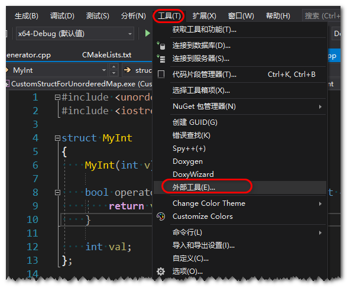

然后点击新建，添加 Doxygen 工具，具体内容如下：

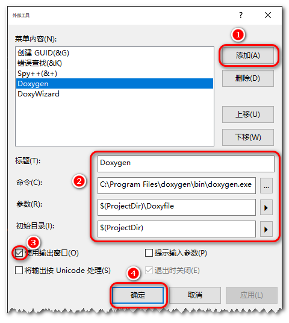

然后再次新建，添加 DoxyWizard 工具，具体内容如下：

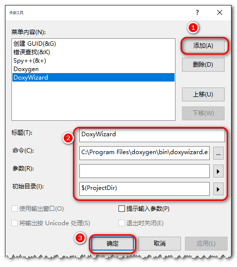

当这些配置好之后，就可以直接在 Visual Studio 的工具菜单中打开。

## 在 Visual Studio 中配置 Doxygen 格式


首先打开 “工具” -> "选项"

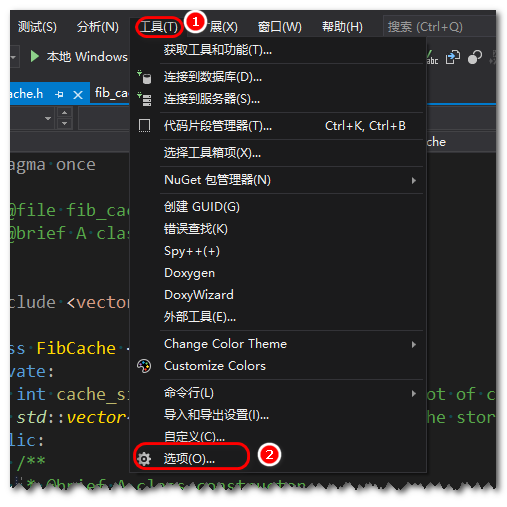

然后找到 “文本编辑器” -> "C/C++" -> "代码样式" -> “常规”，然后设置生成的文档注释样式

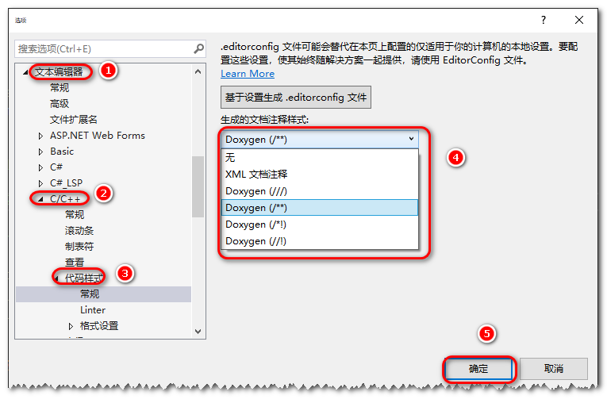

这里有四种 Doxygen 样式可以设置

`/**` 是 Javadoc style 

```cpp
/**
 * ... text ...
 */
```

`/*!` 是 Qt style

```cpp
/*!
 * ... text ...
 */
```

其他两种是使用至少两个 C++ 注释行组成的块，其中每行以一个额外的斜杠或感叹号开头。

```cpp
///
/// ... text ...
///
```

```cpp
//!
//!... text ...
//!
```

设置好这些配置后，直接将光标放置在类、函数等可以添加注释的地方，使用快捷键 `ctrl` + `/` 就可以直接生成文档注释模板。然后填上具体信息就可以了。

## Doxygen 文档注释的语法

Doxygen 中可以使用的语法有很多，这里就不直接列出来了，直接查看官网即可。

* [Special Commands](https://www.doxygen.nl/manual/commands.html)

## Doxygen 例子程序

首先创建一个名为 DoxygenTest 的空项目，然后添加以下文件到项目中。

[fib.h](https://github.com/OU-CS3560/examples/blob/master/fib/fib.h)

```cpp
#pragma once
/**
 * @file fib.h
 * @brief Define functions to calculate fibonacci.
 *
 * This is the include file for the fibonacci library.
 * It contains various functions to calculate the fibonacci
 * number.
 *
 * @author Krerkkiat Chusap
 */
#include <iostream>

 /**
  * @brief Calculate Fibonacci recursively
  *
  * This function will calculate the n-th Fibonacci recursively.
  * The base cases for the calculation are:
  * - n == 1 -> 1
  * - n == 2 -> 1
  *
  * @param n The n-th position of the Fibonacci number to get.
  * @return The value of the Fibonacci number at position n-th.
  */
int fib_recursive(int n);

/**
 * @brief Calculate Fibonacci iteratively
 *
 * This function calculates the n-th Fibonacci number iteratively. It
 * starts from n==3 with the the following starting values:
 * - n == 1 -> 1
 * - n == 2 -> 1
 *
 * @param n The n-th position of the Fibonacci number to get.
 * @return The value of the Fibonacci number at position n-th.
*/
int fib_iterative(int n);

```

[fib.cpp](https://github.com/OU-CS3560/examples/blob/master/fib/fib.cc)

```cpp
/**
 * @file fib.cc
 * @brief An implementation of the functions.
 *
 * All the documentation for these functions are in the .h file already.
 */
#include "fib.h"

int fib_recursive(int n) {
    if (n == 1 || n == 2) {
        return 1;
    }

    return fib_recursive(n - 1) + fib_recursive(n - 2);
}

int fib_iterative(int n) {
    int a, b, temp;
    a = 1;
    b = 1;

    if (n == 1 || n == 2) {
        return 1;
    }

    for (int i = 3; i <= n; i++) {
        temp = b;
        b = a + b;
        a = temp;
    }

    return b;
}
```

[fib_cache.h](https://github.com/OU-CS3560/examples/blob/master/fib/fib_cache.h)

```cpp
#pragma once
/**
 * @file fib_cache.h
 * @brief A class definition for FibCache.
 *
 */
#include <vector>

class FibCache {
private:
    int cache_size; //!< The length of the slot of cache.
    std::vector<int> cache; //!< Internal cache storage. It is based on vector.
public:
    /**
     * @brief A class constructor.
     *
     * 可以展示中文噢
     *
     * @param cache_size The size of the cache storage.
     */
    FibCache(int cache_size) : cache_size{ cache_size } {
        if (cache_size < 2) {
            cache_size = 2;
        }

        cache.resize(cache_size);

        // Zero initialize.
        for (std::vector<int>::iterator itr = cache.begin(); itr != cache.end(); itr++) {
            *itr = 0;
        }
        cache[0] = 1;
        cache[1] = 1;
    };

    /**
     * @brief A class destructor.
     *
     * It is used to free resources used by a class.
     */
    ~FibCache();

    /**
     * @brief Answer the query for n-th
     *
     * It will try to answer the query using cached value. If that
     * is not possible, it will calculate and answer.
     *
     * This uses \ref fib_recursive function.
     *
     * @param n The n-th position of the Fibonacci number to get.
     */
    int get(int n);
};

```

[fib_cache.cpp](https://github.com/OU-CS3560/examples/blob/master/fib/fib_cache.cc)

```cpp
/**
 * @file fib_cache.cc
 * @brief Implementation of the FibCache class.
 *
 * All the documentation for these member functions are in the .h file already.
 *
 */
#include "fib.h"
#include "fib_cache.h"

FibCache::~FibCache() { }

int FibCache::get(int n) {
    // Catch invalid n.
    if (n < 1) {
        return 0;
    }

    // Check if cache is available.
    if (cache[n - 1] != 0) {
        return cache[n - 1];
    }

    int result = fib_recursive(n);
    cache[n - 1] = result;

    return result;
}
```

[main.cpp](https://github.com/OU-CS3560/examples/blob/master/fib/main.cc)

```cpp
/**
 * @file main.cc
 * @author Krerkkiat Chusap
 * @brief The main() function as an example to test the fibonacci function.
 */
#include <iostream>

#include "fib.h"
#include "fib_cache.h"

int main() {
    int n;
    std::cout << "Please enter n: ";
    std::cin >> n;

    std::cout << "Fib(n) is " << fib_recursive(n) << std::endl;

    FibCache fib_cache(5);
    std::cout << "FibCache(n) is " << fib_cache.get(n) << std::endl;

    return EXIT_SUCCESS;
}
```

## 使用 DoxyWizard 工具生成文档

首先在 “工具” -> “DoxyWizard” 打开 Doxygen gui 工具

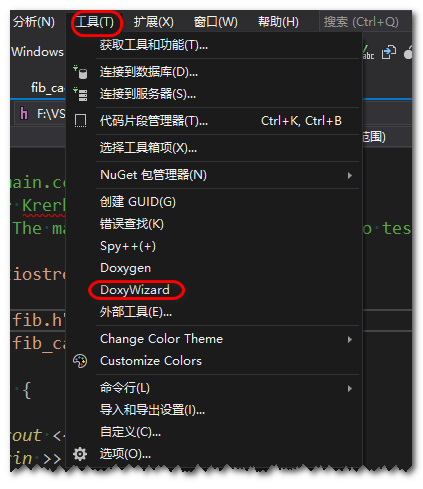

然后选择项目的路径，对于 Visual studio 项目，需要选择 `*.vcxproj` 文件所在的路径，然后填写相关的信息。我这里为了测试只是简单的填了工程名

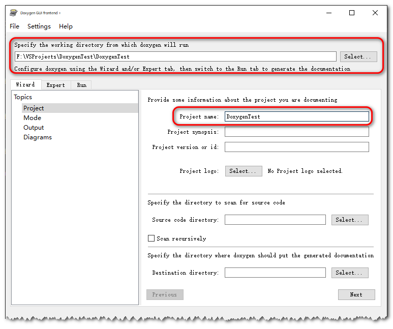

然后在 "Wizard" -> “Output” 中选择 HTML 输出为 `with navigation panel`，表示带有导航的 HTML 页面。同时不勾选 LaTeX，表示不生成 LaTeX 文档。

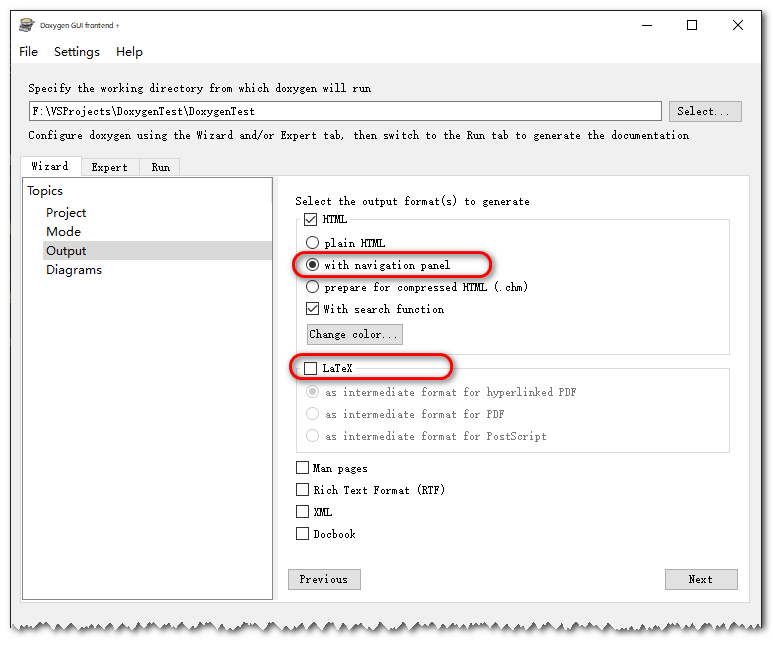

然后对于编码，Visual Studio 默认是使用的 GB2312，所以将 “Expert” -> “Project” 中的 `DOXYFILE_ENCODING` 设置为空，选择 `OUTPUT_LANGUAGE` 为 `Chinese`。

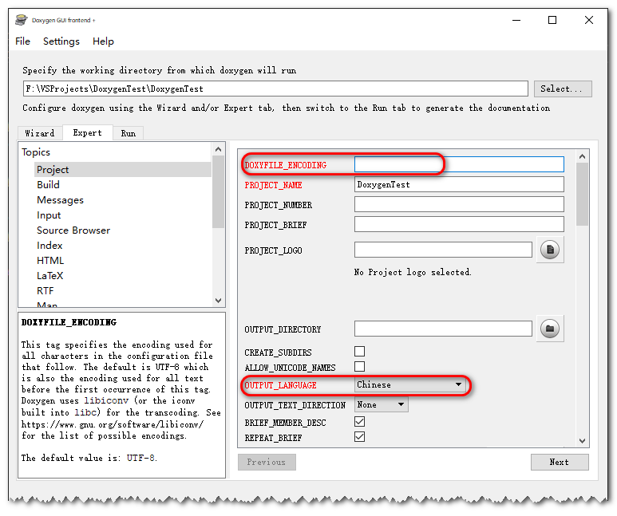

然后设置 “Expert” -> “Input” 中的 `INPUT_ENCODING` 为 `GBK`

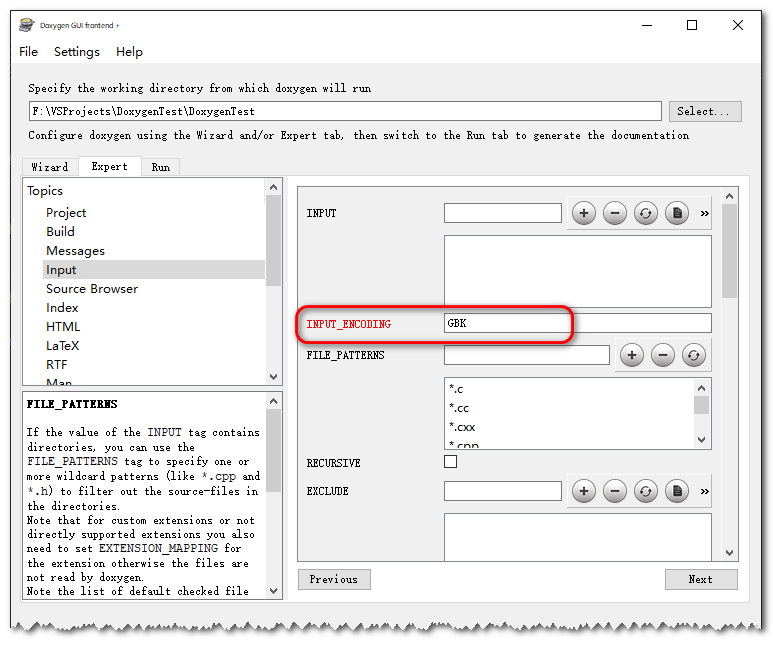

然后点击生成按钮就可以生成文档了，生成之后可以直接点击展示按钮进行查看。

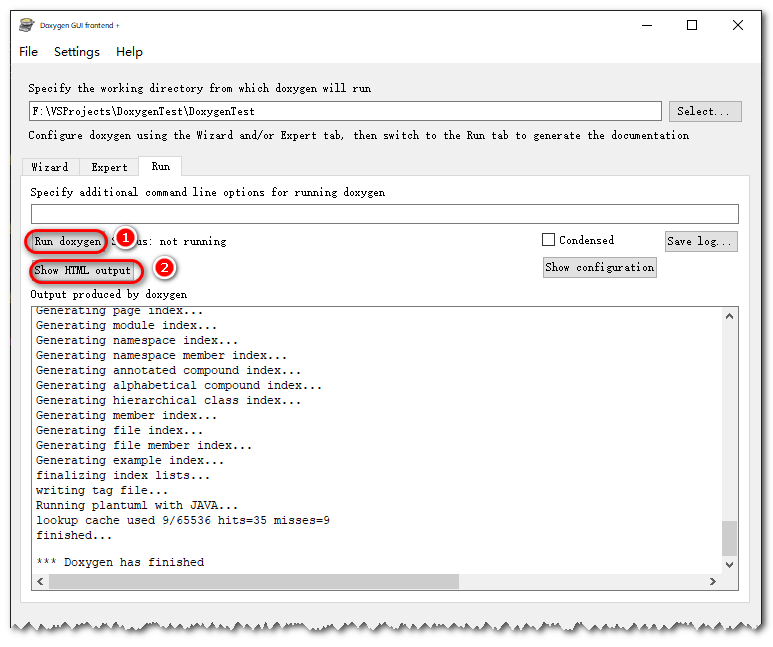

最终生成的效果如下：

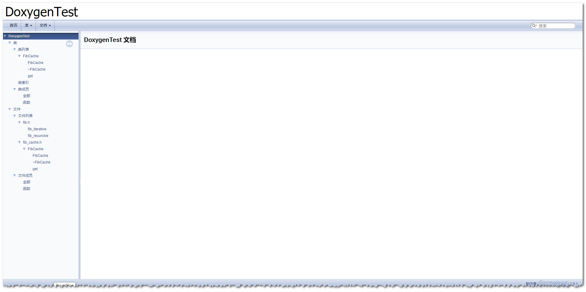

如果界面出现中文乱码，可以将 `DOXYFILE_ENCODING` 和 `INPUT_ENCODING` 设置为 `UTF-8`，同时在高级保存选项中将代码的编码设置为 `utf-8`。

该工具中还有许多设置，当鼠标放到设置项上时，左下角会展示具体每个参数的定义。这个有时间后续再补充。