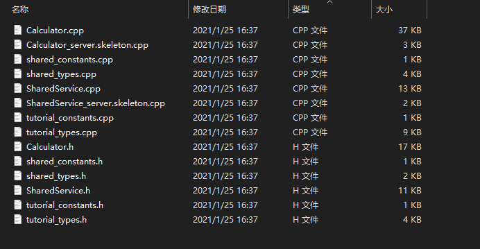

# Apache Thrift C++ 在 Windows 上编译

## 测试环境

* Windows 10 64位
* MS Visual Studio 2019 (msvc142)
* Apache Thrift 0.12.0
* Boost 1.72.0
* OpenSSL 1.1.1
* Libevent 2.1.12


## 编译 Boost

[下载链接](https://sourceforge.net/projects/boost/files/boost-binaries/)

首先从上面的链接下载想要版本的 Boost C++ 库，我这里使用的是 `1.72.0`，因为我使用的是 VS2019，所以我下载的是 `boost_1_72_0-msvc-14.2-64.exe`。

下载完成后，双击 exe 文件执行，我这里选择的是默认释放目录 `C:\local\boost_1_72_0`

释放源码完成后，打开 VS2019 命令行工具

```
开始菜单-> Visual Studio 2019 -> Developer Command Prompt for VS 2019
```


然后进入到 Boost 源码目录

```bash
cd C:\local\boost_1_72_0
```

然后顺序执行以下命令，然后等待安装成功即可

```bash
bootstrap.bat

b2
```

编译成功会提示 `The Boost C++ Libraries Were successfully built!`

编译完成后，下面两个路径会在后面使用：

```
包含目录: C:\local\boost_1_72_0
库目录: C:\local\boost_1_72_0\stage\lib
```

## OpenSSL 编译

OpenSSL 我这里使用的是编译好的 binary 文件，直接下载 exe 文件然后解压即可

下载链接: [Win32/Win64 OpenSSL](https://slproweb.com/products/Win32OpenSSL.html)

关于 binary 文件的其他版本可以参考：[Binaries](https://wiki.openssl.org/index.php/Binaries)

## LibEvent 编译

> LibEvent 的编译依赖于 OpenSSL，需要先编译 OpenSSL。

[下载地址](https://libevent.org/)

首先从官网下载 libevent 源码，我这里下载的是 libevent-2.1.12-stable.tar.gz 

下载完解压出来后根据 `Readme.md` 中的说明进行编译，我这里使用的 cmake-gui 来进行编译的，配置好源路径和输出路径，点击 `configure`。


此时会弹出文件夹不存在的提醒


点击确定之后会弹出配置选项窗口，这里我选择 Visual Studio 2019，默认编译 x64 版本


配置完成后，界面中配置选项会变成红色，可以对里面的参数进行修改，比如修改安装路径啥的。我这里直接使用默认的配置。当修改完后再次点击 `Configure`，此时参数会变成白色，同时结果中展示 `Configuring done`。


然后再点击 `Generate` 生成 VS2019 项目，生成成功之后会提示 `Generating done`。


生成完成之后可以点击 `Open Project` 打开 VS2019 项目，但是由于默认库安装地址为 `C:/Program Files (x86)/libevent` (由 `CMAKE_INSTALL_PREFIX` 指定)，可能在安装的时候需要管理员权限，所以可用先用管理员打开 VS2019，然后再打开项目。

打开项目后，因为我这里编译 64 位，所以修改平台为 x64，然后右键 `ALL_BUILD`，选择生成。编译成功之后，再右键 `INSTALL`，选择生成，执行后会在 `C:/Program Files (x86)/libevent` 生成库相关的内容。

## Apache thift 编译

首先下载源代码，[下载地址](https://github.com/apache/thrift/releases)


`thrift.exe` 为编译程序，是将 `.thrift` 文件编译为 `.h` 和 `.cpp` 的程序。

由于我们这里要编译的是 c++ 版本，所以编译的项目路径为 `x:\xxxx\thrift-0.12.0\lib\cpp`，在该目录下，有一个 VS 工程，直接用 VS 打开即可


打开解决方案之后，里面有两个项目，要能够正常编译，需要配置一些包含头文件目录

对于 `libthrift` 和 `libthriftnb` 项目，都添加以下配置

* 属性 -> C/C++ -> 常规 -> 附加包含目录
    ```
    C:\local\boost_1_72_0
    F:\github\OpenSSL-Win64\include
    C:\Program Files %28x86%29\libevent\include
    ```
> 注：我这里使用的是绝对路径，需要你根据具体情况进行替换

然后选择对应的平台，编译就能生成库文件 `libthrift.lib` 和 `libthriftnb.lib`。

如果出现未找到 `thrift\config.h` 文件，需要手动添加 `F:\github\thrift-0.12.0\lib\cpp\src\thrift\config.h`，内容如下：

```cpp
#pragma once
#include <stdlib.h>
#include <string.h>

#define PACKAGE_VERSION "0.12.0"

```

为了方便，我把这两个编译文件放到了以下路径：

```
F:\github\thrift-0.12.0\lib\cpp\lib\debug
```

## Thrift example

首先我创建了一个 `example` 文件夹，位置随意，然后拷贝之前下载的 `thrift.exe` 到该文件夹中，然后再拷贝 `F:\github\thrift-0.12.0\tutorial` 目录下的 `shared.thift` 和 `tutorial.thrift` 到该文件夹中，然后执行以下命令行

```bash
thrift -r --gen cpp tutorial.thrift
```

之后会在该文件夹下生成一个 gen-cpp 文件夹，文件夹中的内容如下：



然后打开 VS2019 新建两个空项目，一个为 `Client`，一个为 `Server`，然后将上面生成的文件拷贝到项目中。

拷贝后将除了 `*.skeleton.cpp` 的文件添加到项目中，然后把 `F:\github\thrift-0.12.0\tutorial\cpp\CppClient.cpp` 文件拷贝到 Client 项目中，把 `F:\github\thrift-0.12.0\tutorial\cpp\CppServer.cpp` 拷贝到 Server 项目中。然后分别编译生成执行程序。

> 注： 添加了 `CppClient.cpp` 和 `CppServer.cpp` 文件后需要将 #include `"../gen-cpp/Calculator.h"` 修改为 `#include "Calculator.h"`

然后配置项目的属性如下：

* 属性 -> C/C++ -> 常规 -> 附加包含目录
    ```
    F:\github\thrift-0.12.0\lib\cpp\src
    F:\github\thrift-0.12.0\lib\cpp\src\thrift\windows
    C:\local\boost_1_72_0
    ```

* 属性 -> 链接器 -> 输入 -> 附加依赖项
    ```
    libboost_thread-vc142-mt-gd-x64-1_72.lib
    libboost_chrono-vc142-mt-gd-x64-1_72.lib
    libthrift.lib
    ```

> 具体的以 `C:\local\boost_1_72_0\stage\lib` 文件夹中的名字为准

* 属性 -> 链接器 -> 常规 -> 附加库目录
    ```
    F:\github\thrift-0.12.0\lib\cpp\lib\debug
    C:\local\boost_1_72_0\stage\lib
    ```

> `F:\github\thrift-0.12.0\lib\cpp\lib\debug` 路径为我为了方便创建的路径，具体见前面


编译好之后新开两个命令行窗口，分别执行服务器和客户端。


至此，thrift 就已经编译测试完成了。